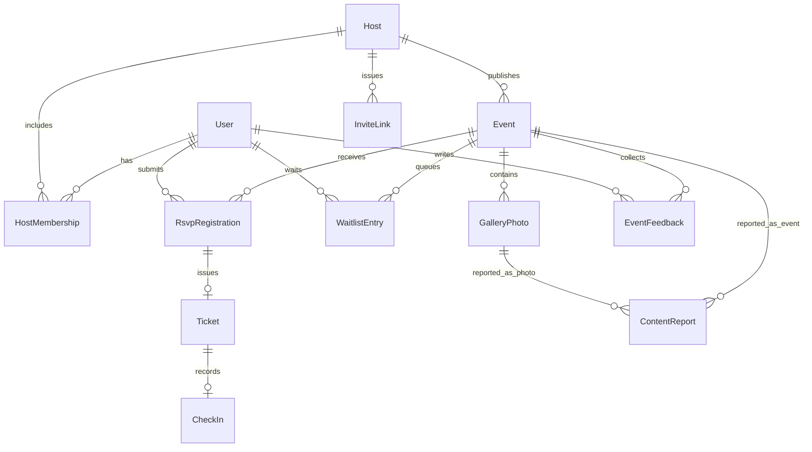
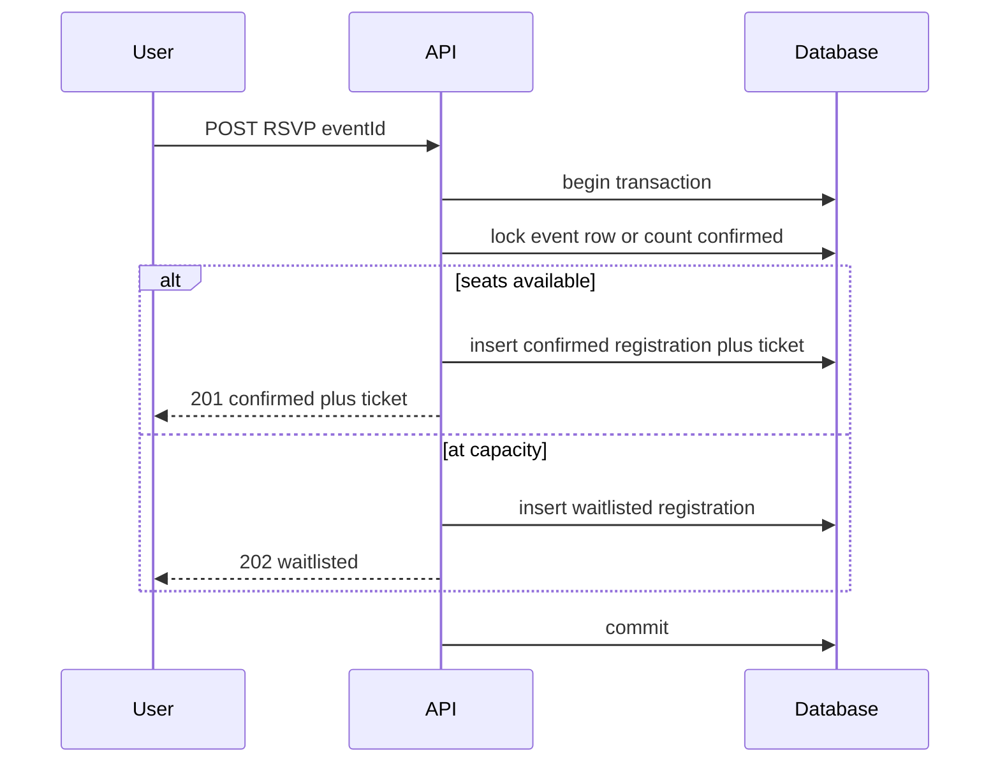
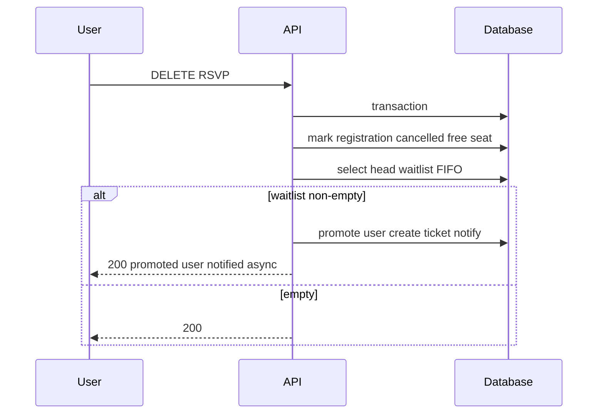
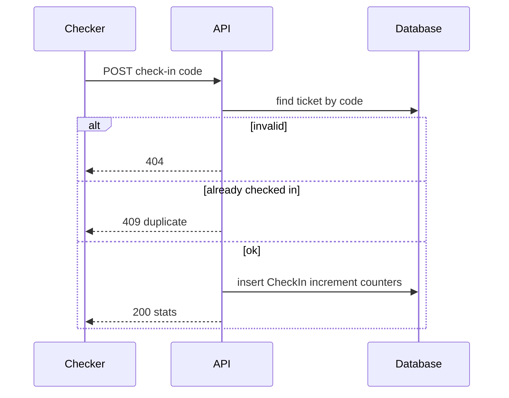
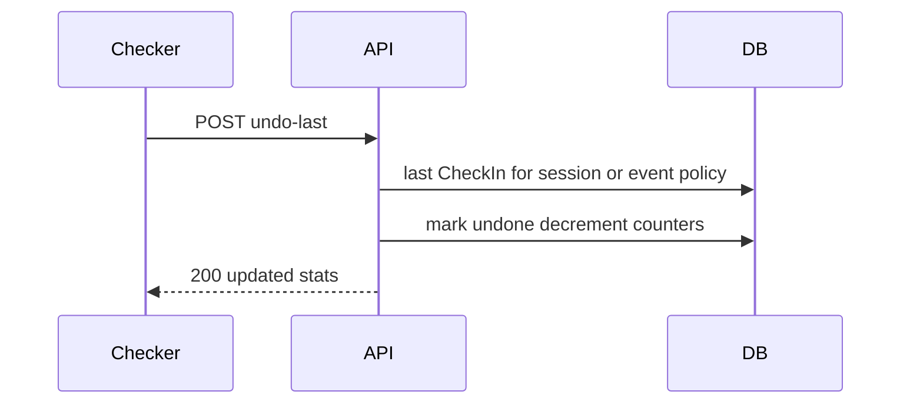
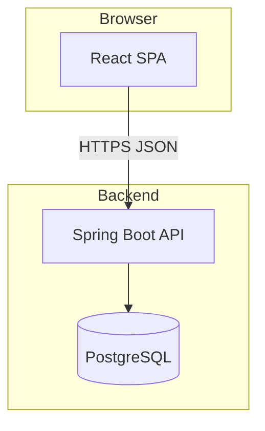

# Software Design Document (SDD)

**Product:** Lightweight event hosting and attendance platform  
**Source requirements:** [requirements.txt](../requirements.txt) (repository root)  
**Companion:** [FEATURES.md](FEATURES.md) — per-feature cards F01–F20 · [SDD-TASKS.md](SDD-TASKS.md) — эпики и таски реализации  

---

## 0. Moderation model for reports (resolved)

**Decision:** Items reported under **F17** are reviewed and can be hidden by users with the **Host** role (not Checker) on the **owning Host organization** of the reported content.

| Report target | Review queue visible to | Hide / dismiss |
|---------------|-------------------------|----------------|
| Event | Host members with role `Host` for the Host that owns the event | Same |
| Gallery photo | Host members with role `Host` for the Host that owns the parent event | Same |

**Rationale:** [requirements.txt](../requirements.txt) assigns gallery approval and “all management actions” to the Host role (L30–31, L43) and does not define a separate platform administrator. A global moderator role would be out of scope unless explicitly added later.

**Checker:** No access to the report review queue (L31: Checker limited to check-in).

**Reporter:** [requirements.txt](../requirements.txt) states any **user** may report (L44). **MVP recommendation:** allow both guests and signed-in users to file reports; for **guests**, require anti-abuse controls (CAPTCHA, strict IP rate limits, honeypot). Signed-in reporters inherit account-level rate limits. If implementation ships signed-in-only, document the deviation from L44 in `report.md`.

---

## 1. Goals and non-goals

### 1.1 Goals (in scope)

- Self-serve **Host** registration and public **Host** profile (L6–7).
- **Events** with full editorial fields, Draft/Published, Public/Unlisted, Duplicate, Publish/Unpublish (L8–9).
- **Explore** discovery with filters; past events show **Ended** and hide RSVP (L13–15, L60).
- **RSVP** with sign-in, capacity, **FIFO waitlist**, auto-promotion, in-app visibility of promotion (L18–25, L54).
- **Tickets** with unique payload for QR, calendar add, cancel RSVP, **My Tickets** (L20–22).
- **Host / Checker** roles, invite links, permission boundaries (L28–32, L38–39).
- **Host dashboard**, **CSV** export (Excel/Sheets-safe), **My Events** (L33–35, L58).
- **Check-in** page: manual code entry, live counters, no duplicate check-in, undo last scan (L38–39, L55).
- **Post-event feedback** and **gallery** with Host approval; **report** queue per Section 0 (L42–44, L56–57).
- **Submission artifacts:** deploy URL, seeds, sample CSV, `report.md`, usage README (L63–67).

### 1.2 Non-goals (MVP)

- **Paid tickets / payments** — UI shows Free/Paid toggle with Paid disabled and “Coming soon” (L10, L59).
- **Camera-based QR scanning** as a hard requirement — not required; manual entry sufficient (L38).
- **Multi-tenant billing**, **email delivery** beyond what is needed for product flows (optional implementation detail).

---

## 2. Actors and roles

| Actor | Description |
|-------|-------------|
| Guest | Unauthenticated; may browse events including past (L50). |
| User | Authenticated account. |
| Host org member `Host` | Full management: events, dashboard, CSV, gallery approval, report queue for own org, invites (L30–31). |
| Host org member `Checker` | Check-in pages for events under that Host only (L31). |

**Host organization:** Logical tenant; has profile (name, logo, bio, contact email) and members (L6–7, L28–29).

---

## 3. Entity states and time rules

### 3.1 Event

- **Lifecycle:** `Draft` | `Published` (L9). Actions: Publish, Unpublish, Duplicate (L9).
- **Visibility:** `Public` (searchable in Explore) | `Unlisted` (link-only) (L9).
- **Temporal:** `now < start` → upcoming; `start ≤ now < end` → live; `now ≥ end` → **ended** (L14, L60). Ended is derived, not necessarily a stored enum, but UI must show **Ended** and hide RSVP (L14, L60).

### 3.2 RSVP / ticket / waitlist

- **RSVP outcome:** `confirmed` (has seat), `waitlisted`, `cancelled` (L19–22, L24).
- **Ticket:** Issued when `confirmed`; unique check-in code / QR payload (L20, L38).
- **Waitlist:** FIFO queue per event; promotion when seat opens (cancellation or capacity increase) (L24–25).

### 3.3 Gallery

- `pending_approval` | `approved` | `rejected` (implied by L43); public listing only `approved`.

### 3.4 Report

- `open` | `dismissed` | `content_hidden` (implementation names may vary; behavior: can be hidden from public view, L44, L57).

---

## 4. Invariants and business rules

1. **Capacity:** Count of `confirmed` RSVPs ≤ `capacity` (L19).
2. **Waitlist FIFO:** Strict queue order; on seat available, promote exactly one head-of-queue if any (L24–25).
3. **Single active RSVP per user per event:** User cannot be both confirmed and waitlisted; re-RSVP after cancel joins tail if full (clarify in API: new waitlist position on re-join).
4. **Check-in:** At most one successful check-in per ticket; duplicates rejected; **undo** reverses only the **last** successful scan in the current checker session (L39) — persist session server-side or define “last globally per event” for MVP; **SDD choice:** undo applies to **last check-in recorded in the current browser session** for that event (simplest UX); document if changed to “last event-wide.”
5. **Time zones:** Store instants in UTC; display/editor uses event’s configured time zone (L8).
6. **CSV:** UTF-8 with BOM optional for Excel; columns: name, email, RSVP status, check-in time (L34).

---

## 5. Logical data model (ER)

**Key fields (indicative):**

- `User`: id, email, name, auth subject, …
- `Host`: id, displayName, logoUrl, bio, contactEmail, slug, …
- `HostMembership`: userId, hostId, role (`HOST` | `CHECKER`), createdAt
- `Event`: hostId, title, description, startAt, endAt, timezone, venueText, onlineUrl, capacity, coverImageUrl, visibility, lifecycle, …
- `RsvpRegistration`: eventId, userId, status, waitlistPosition nullable, promotedAt nullable
- `Ticket`: id, registrationId, publicCode (or signed token), qrPayload, createdAt
- `WaitlistEntry`: eventId, userId, position, enqueuedAt
- `CheckIn`: ticketId, eventId, checkedInAt, checkedInByUserId (checker), undoneAt nullable
- `GalleryPhoto`: eventId, submittedByUserId, url, moderationStatus, …
- `EventFeedback`: eventId, userId, stars, comment, createdAt
- `ContentReport`: targetType, targetId, reporterId, status, createdAt, resolvedByUserId nullable
- `InviteLink`: hostId, role, token hash, expiresAt optional

---

## 6. Key sequences

### 6.1 RSVP: confirmed vs waitlist

### 6.2 Cancellation and waitlist promotion

### 6.3 Check-in and duplicate prevention

### 6.4 Undo last scan (session-scoped)

---

## 7. API draft (REST-shaped)

Conventions: JSON; `401` unauthenticated; `403` forbidden; `404` not found; `409` conflict (capacity, duplicate check-in).

| Area | Method | Path (example) | Notes |
|------|--------|----------------|-------|
| Auth | — | OAuth2/OIDC or session per stack | Return URL after login (L18, L51) |
| Host | POST | `/api/hosts` | Self-serve register (L6) |
| Host | GET | `/api/hosts/{slug}` | Public profile (L7) |
| Host | PATCH | `/api/hosts/{id}` | Host role only |
| Events | CRUD | `/api/hosts/{hostId}/events` | Draft/Published, visibility (L8–9) |
| Events | POST | `/api/events/{id}/publish` | (L9) |
| Events | POST | `/api/events/{id}/unpublish` | |
| Events | POST | `/api/events/{id}/duplicate` | |
| Explore | GET | `/api/events?query=&from=&to=&location=&includePast=` | L13 |
| RSVP | POST | `/api/events/{id}/rsvp` | Auth required (L18) |
| RSVP | DELETE | `/api/events/{id}/rsvp` | Cancel (L22) |
| Tickets | GET | `/api/me/tickets` | Upcoming (L22) |
| Check-in | GET | `/api/events/{id}/check-in` | Meta + stats; Checker (L38) |
| Check-in | POST | `/api/events/{id}/check-in` | Body: code (L38–39) |
| Check-in | POST | `/api/events/{id}/check-in/undo-last` | L39 |
| Dashboard | GET | `/api/hosts/{hostId}/dashboard/summary` | L33 |
| Export | GET | `/api/events/{id}/export/rsvps.csv` | Host role (L34) |
| My Events | GET | `/api/me/events?...` | L35, L58 |
| Gallery | POST | `/api/events/{id}/gallery` | Attendee upload (L43) |
| Gallery | POST | `/api/gallery/{photoId}/approve` | Host (L43) |
| Feedback | POST | `/api/events/{id}/feedback` | After end (L42) |
| Reports | POST | `/api/reports` | Target event or photo (L44) |
| Reports | GET | `/api/hosts/{hostId}/reports` | Host role queue (Section 0) |
| Reports | POST | `/api/reports/{id}/resolve` | hide or dismiss (L57) |
| Invites | POST | `/api/hosts/{hostId}/invites` | Copyable link (L29) |

**Promotion visibility (L25):** On promotion, set in-app notification or flag read by client on next load of My Tickets / event page.

---

## 8. UI routes (indicative)

| Route | Guest | User | Checker | Host |
|-------|-------|------|---------|------|
| `/explore` | yes | yes | yes | yes |
| `/events/:slugOrId` | yes | yes | yes | yes |
| `/hosts/:slug` | yes | yes | yes | yes |
| `/sign-in` | yes | — | — | — |
| `/become-host` | — | yes | — | — |
| `/host/:hostId/dashboard` | — | — | — | Host |
| `/host/:hostId/events/...` | — | — | — | Host |
| `/events/:id/check-in` | — | — | yes | Host |
| `/me/tickets` | — | yes | yes | yes |
| `/me/events` | — | if has role | yes | yes |
| `/host/:hostId/reports` | — | — | — | Host |

SSR or meta tags for **social preview** on event and host public pages (L15).

---

## 9. Non-functional requirements

- **Security:** HTTPS; CSRF protection for cookie-based auth; rate limit report and RSVP endpoints; invite tokens stored hashed; check-in codes unguessable (high entropy).
- **Privacy:** Export limited to Host role; email visible only per policy (export includes email for operational need, L34).
- **Live counters on check-in:** Short polling (e.g. 2–5s) or SSE acceptable for MVP (L39); document chosen approach in implementation.
- **CSV:** Compatible with Excel and Google Sheets (L34); include header row; UTF-8 BOM if needed.
- **Accessibility:** Manual code path for check-in must be keyboard-friendly (L38).

---

## 10. Traceability matrix (requirements → features)

| Requirement lines | Feature IDs |
|-------------------|-------------|
| L6–7 | F02 |
| L8–10 | F03, F04 |
| L13–15, L50, L60 | F05 |
| L15 | F06 |
| L18, L51 | F01 |
| L19–22, L53 | F07, F08 |
| L24–25, L54 | F07 |
| L28–32, L55, L58 | F09, F10, F14, F13 |
| L33–35 | F11, F13 |
| L34, L66 | F12 |
| L38–39 | F14 |
| L42–44, L56–57 | F15, F16, F17 |
| L63–67 | F18, F19, F20 |

Full acceptance detail: [FEATURES.md](FEATURES.md).

---

## 11. Implementation order (vertical slices)

1. Application skeleton + **F01** (auth + return URL).
2. **F02**, **F03**, **F04** (Host profile, events lifecycle, paid toggle UI).
3. **F05**, **F06** (Explore, OG/meta).
4. **F07**, **F08** (RSVP, waitlist, tickets, My Tickets).
5. **F09**, **F10**, **F14** (roles, permissions, check-in).
6. **F11**, **F12**, **F13** (dashboard, CSV, My Events).
7. **F15**, **F16**, **F17** (feedback, gallery, reports).
8. **F18**–**F20** (seeds, deploy, docs artifacts).

---

## 12. Architecture and stack

### 12.1 Chosen stack

| Layer | Technology |
|-------|------------|
| Backend | **Java 21**, **Spring Boot 3**, **Spring Web**, **Spring Security**, **Spring Data JPA** |
| Database | **PostgreSQL** |
| Migrations | **Flyway** |
| API docs | **springdoc-openapi** (optional for dev) |
| Frontend | **React (Vite) + TypeScript** SPA consuming REST, or **Thymeleaf** + HTMX for simpler MVP — default recommendation **React SPA** for Explore/filters and check-in UX |
| Auth | **Spring Security** with OAuth2 Login (e.g. Google/GitHub) or email magic link — choose one for challenge speed |
| Deployment | Container (Docker) + managed PostgreSQL; or PaaS (Railway, Render, Fly.io) |

### 12.2 Rationale

- Requirements read as a **classic web product** with clear **REST** boundaries, **relational** integrity (waitlist FIFO, roles), and **CSV** export — fits **Spring Boot + JPA** well.
- **PostgreSQL** gives robust constraints and transactions for promotions and check-in idempotency.
- **React** (or similar) satisfies rich filtering and real-time-ish check-in page without fighting server-rendered forms.

### 12.3 Deployment topology

Static assets for SPA may be served from the same Spring Boot jar (`src/main/resources/static`) or CDN; single origin simplifies cookies if used.

---

## 13. Submission checklist (artifacts)

- [ ] Public deployed URL (L63)
- [ ] Seeded: ≥1 Host, ≥1 upcoming event, ≥1 past event (L64)
- [ ] Example CSV file matching export schema (L66)
- [ ] `report.md` at repo root (L65)
- [ ] README usage guide: Publish → RSVP → Ticket → Check-in (L67)
- [ ] Public GitHub repo, project under `task-2` folder (L68)

---

*End of SDD master document.*
