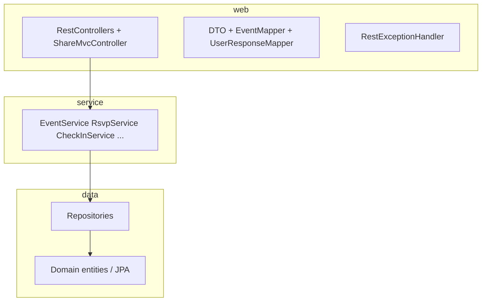
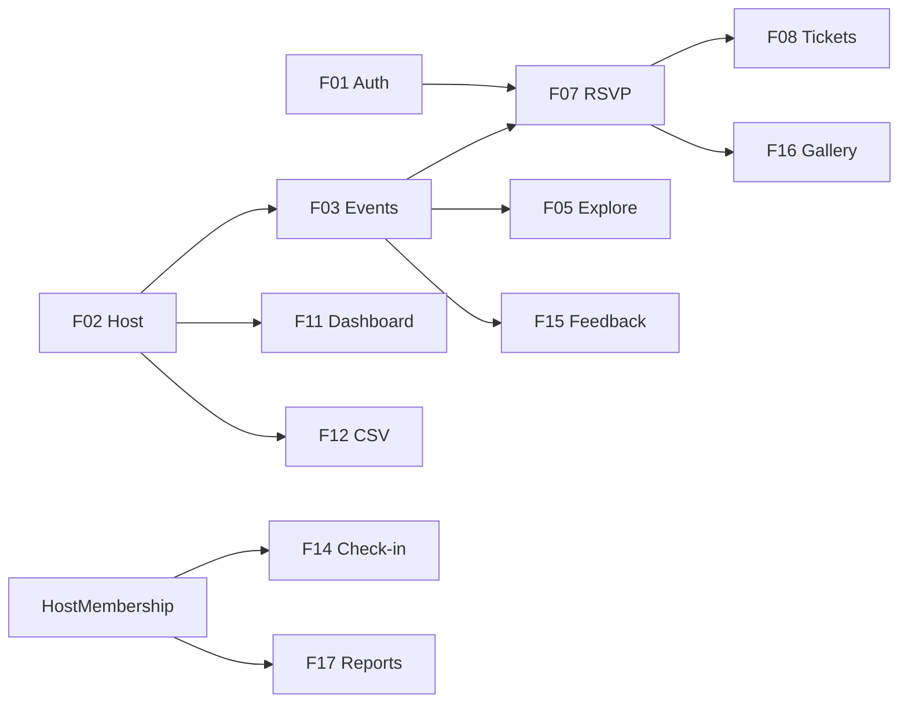

# Project map — event-platform (task-2)

Карта репозитория: структура каталогов, слои backend, основные HTTP-маршруты и связь с UI. Детали поведения — в [SDD.md](../SDD.md) и [FEATURES.md](../FEATURES.md).

---

## 1. Дерево репозитория (логические зоны)

```text
task-2/
├── pom.xml                    # Spring Boot 3.2, Java 21; verify = Checkstyle + SpotBugs
├── config/
│   ├── checkstyle/checkstyle.xml
│   └── spotbugs/exclude.xml
├── docker-compose.yml         # PostgreSQL для локальной разработки
├── README.md                  # Запуск и ручные сценарии
├── report.md                  # Отчёт по заданию
├── .gitignore
├── scripts/                   # Windows: JAVA_HOME + Maven (run.ps1, set-java-home-user.ps1)
├── samples/
│   └── rsvps-example.csv      # Пример CSV для импорта/документации
├── ../.github/workflows/      # GitHub Actions (в корне монорепо)
│   ├── ci.yml
│   └── lint.yml
├── docs/
│   ├── SDD.md                 # Проектное ТЗ
│   ├── FEATURES.md            # Карточки F01–F20
│   ├── SDD-TASKS.md           # Эпики и таски
│   └── project-map/
│       └── PROJECT_MAP.md     # Этот файл
├── frontend/                  # Опциональный React (Vite); сборка может перезаписать static/
│   ├── package.json
│   ├── vite.config.js
│   └── src/
└── src/main/
    ├── java/com/events/platform/
    │   ├── EventPlatformApplication.java
    │   ├── config/            # Security, Web, Flyway-соседство, сиды
    │   ├── domain/            # JPA-сущности
    │   ├── repo/              # Spring Data JPA
    │   ├── service/           # Бизнес-логика
    │   └── web/               # REST, MVC share, DTO, ошибки
    └── resources/
        ├── application.yml
        ├── db/migration/      # Flyway SQL
        └── static/            # Встроенный SPA (hash-роутинг)
            ├── index.html
            └── assets/
                ├── app.js
                └── app.css
```

Сборка Maven кладёт классы и копию `resources` в **`target/`** (в git не коммитится).

---

## 2. Слои backend (`com.events.platform`)



| Пакет | Назначение |
|-------|------------|
| **`config`** | `SecurityConfig` (сессия, `AuthenticationManager`, CSRF off), `WebConfig` (статика, `/uploads/**`, SPA fallback), `DataSeed` + `SeedDemoConstants`, при необходимости точки расширения |
| **`domain`** | Сущности: `User`, `Host`, `HostMembership`, `Event`, `RsvpRegistration`, `Ticket`, `CheckIn`, `GalleryPhoto`, `EventFeedback`, `ContentReport`, `InviteLink`, перечисления |
| **`repo`** | Интерфейсы `JpaRepository` + кастомные `@Query` (например `EventRepository.searchExplore`) |
| **`service`** | Транзакции и правила: `EventService`, `RsvpService`, `CheckInService`, `AccessControlService`, `DashboardService`, `CsvExportService`, `GalleryService`, `FeedbackService`, `ReportService`, `InviteService`, `SlugService`, `AuthUserDetailsService` |
| **`web`** | `*ApiController`, `AuthController`, DTO (`web/dto`), `SecurityUtils`, `EventMapper`, обработка ошибок |

---

## 3. REST API (группировка по домену)

Префикс **`/api`** (кроме отдельных MVC-путей ниже).

| Зона | Контроллер / путь | Назначение |
|------|-------------------|------------|
| Auth | `POST /api/auth/register`, `login`, `logout` | Сессия + cookie |
| Профиль | `GET /api/me`, `/api/me/tickets`, `/api/me/events` | Пользователь, билеты, «мои события» по членствам |
| События (публично + хост) | `GET /api/events`, `GET /api/events/{id}`, RSVP, publish, unpublish, duplicate, capacity | Explore, карточка, RSVP, жизненный цикл |
| Хост | `POST /api/hosts`, `PATCH /api/hosts/{id}`, `GET /api/hosts/by-slug/{slug}`, `POST .../events` | Become host, публичный профиль, создание события |
| Дашборд | `GET /api/hosts/{hostId}/dashboard` | Сводка + счётчики check-in (только роль **HOST**) |
| Check-in | `GET/POST /api/events/{eventId}/check-in/...`, заголовок `X-CheckIn-Session` | Статистика, скан, undo |
| CSV | `GET /api/events/{eventId}/export/rsvps.csv` | Экспорт (HOST) |
| Галерея | `GET/POST .../gallery`, `GET .../gallery/pending`, `POST /api/gallery/{id}/approve` | Загрузка, модерация |
| Отзывы | `POST /api/events/{eventId}/feedback` | После окончания события |
| Жалобы | `POST /api/reports`, `GET /api/hosts/{hostId}/reports`, `POST /api/reports/{id}/resolve` | Очередь и разбор (**HOST**) |
| Инвайты | `POST /api/hosts/{hostId}/invites`, `POST /api/invites/accept` | Ссылки с токеном |

**MVC (не под `/api`):**

- **`GET /share/event/{id}`** — HTML с OG-тегами для мессенджеров (`ShareMvcController`).
- Статические **`/uploads/**`** и fallback на **`index.html`** для hash-SPA (`WebConfig`).

---

## 4. UI

| Источник | Роль |
|----------|------|
| **`src/main/resources/static/`** | Основной клиент: `index.html` + `assets/app.js` (роуты `#/explore`, `#/events/:id`, `#/host/...`, check-in, login, invite, …) |
| **`frontend/`** | Альтернатива на React + Vite; не обязателен для запуска JAR |

Браузер ходит на тот же origin; API с `credentials: 'include'` для cookie-сессии.

---

## 5. Данные и инфраструктура

| Артефакт | Назначение |
|----------|------------|
| **`src/main/resources/db/migration/V*.sql`** | Схема PostgreSQL + правки (Flyway) |
| **`application.yml`** | Datasource, JPA (`ddl-auto: validate`), `app.base-url`, `app.upload-dir` |
| **`docker-compose.yml`** | Локальная БД |
| **`DataSeed`** | Демо-пользователи, события, RSVP, билеты, галерея, жалоба, инвайт (только пустая `users`) |

---

## 6. Зависимости между крупными фичами (упрощённо)



---

## 7. Куда смотреть при изменениях

| Задача | Точки входа |
|--------|-------------|
| Новый публичный эндпоинт | `SecurityConfig` + контроллер |
| Правило «только Host» | `AccessControlService` + соответствующий `*Service` |
| Фильтры листинга событий | `EventRepository` / `EventService.explore` |
| Смена схемы БД | Новый файл `V{n}__*.sql` + согласование сущностей |
| Сиды для демо | `DataSeed`, `SeedDemoConstants` |

Обновляйте этот файл (`docs/project-map/PROJECT_MAP.md`) при появлении новых модулей или смене границ пакетов.
