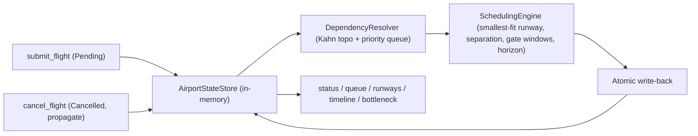

# ATC MCP Server — implementation report

This report documents the scheduling approach used for the AI-ready Air Traffic
Control MCP server, the key decisions behind it, the tools and techniques used
during implementation, and a frank account of what worked and what did not.

---

## 1. Scheduling approach

The scheduler is a deterministic, in-memory algorithm that runs end-to-end
on every `generate_schedule` call. It is built around four ideas:

1. **Topology first, priority second.** Dependencies are a hard constraint.
   Priority is a soft tiebreaker that decides which of two equally-eligible
   flights gets the earlier slot.
2. **Greedy earliest-fit.** For each flight in the resolved order, pick the
   earliest start time that is feasible across all hard constraints (runway
   capability, runway separation, gate availability, horizon).
3. **Smallest-fitting runway.** When several runways could serve a flight, the
   engine prefers the shortest one that still satisfies the runway requirement
   (typical "save the long runways for the heavies" heuristic), with the
   runway id as a deterministic tie-breaker.
4. **Deterministic clock.** The engine never reads `Instant.now()`. All times
   are seconds relative to a configurable `ATC_EPOCH`, so two runs on the same
   inputs produce byte-identical schedules — explicitly verified by
   `DeterminismScenarioTest`.

### Pipeline

### Step-by-step

1. **Snapshot.** `ScheduleService.regenerate` resets every non-cancelled flight
   to `PENDING` and snapshots the cancelled set.
2. **Dependency resolution** ([`DependencyResolver`](src/main/java/com/atc/mcp/scheduler/DependencyResolver.java)).
   Kahn-style topological sort backed by a priority queue ordered by
   `(priority weight asc, flight number asc)`. Flights with missing,
   cancelled, transitively-unscheduled, or cyclic dependencies are excluded
   with a stable `UnscheduledReason` (`DEPENDENCY_MISSING`,
   `DEPENDENCY_CANCELLED`, `DEPENDENCY_UNSCHEDULED`, `DEPENDENCY_CYCLE`).
3. **Per-flight slot search** ([`SchedulingEngine`](src/main/java/com/atc/mcp/scheduler/SchedulingEngine.java)).
   For each flight in the resolved order:
   - `earliestStart = max(0, max(dep.endSec + dependencyBuffer))`.
   - Filter runways by `runwayRequirements.minLengthMeters` (so the Heavy
     Hauler scenario fails fast with `NO_SUITABLE_RUNWAY`).
   - For each candidate runway, walk its sorted bookings and consider every
     "free window" produced by the configured separation buffers (`takeoff /
     landing / mixed`). For each window, attempt to place the operation at
     the earliest start, then iteratively skip forward to the next gate-free
     time if no gate is currently available.
   - Among feasible runway/gate slots across all candidates, pick the one
     with the smallest `(start, runwayLength)` pair.
4. **Failure attribution.** When no slot exists, the engine distinguishes
   `NO_SLOT_WITHIN_HORIZON` (runway saturation) from `NO_GATE_AVAILABLE`
   (gate saturation) by re-running a runway-only fit; this gives clients an
   actionable reason rather than a generic failure.
5. **Atomic write-back.** Results are applied under the store's write lock,
   replacing the schedule and updating each flight's status, assignment and
   reason in a single critical section.

### Bottleneck analysis

[`BottleneckAnalyzer`](src/main/java/com/atc/mcp/scheduler/BottleneckAnalyzer.java)
treats the dependency DAG of *scheduled* flights as a longest-path problem.
A topological-order DP computes, for each node, the longest path ending in it,
where edge weight is `dependency.duration + dependencyBuffer` and node weight
is the operation's own duration. Ties break lexicographically on flight number
so the result is reproducible. The chain is returned only when it contains at
least two flights — a single flight is not a "chain".

---

## 2. Key decisions

| Decision | Why | Trade-off accepted |
|---|---|---|
| **Java 21 + Spring Boot 3 + Spring AI MCP starter** | Aligns with the user's stack rules (`task-2` was Spring Boot too) and keeps tool/resource registration declarative. The `@Tool` annotation auto-generates the JSON schema. | Pulls a heavy framework for what is conceptually a small server. |
| **HTTP/SSE transport only** | Simplest to demo with MCP Inspector, Cursor, Claude Desktop, and any browser-based client. The `spring-ai-starter-mcp-server-webmvc` provides this out of the box. | No STDIO transport, so clients that prefer subprocess wiring need a small SSE bridge. |
| **In-memory state, no DB** | The task is explicitly about scheduling logic, not persistence. Easier to reason about determinism and to test. | Schedule is lost on restart. |
| **Runway capability via list of lengths** (`ATC_RUNWAYS=R1:3500,R2:2500,R3:4000`) | Lets the Heavy Hauler scenario fail with a precise `NO_SUITABLE_RUNWAY` reason; matches the realistic "minimum runway length" mental model. | Slightly more complex to parse than a single integer count. A `Converter` plus a startup validator handles it. |
| **Configurable `ATC_EPOCH` instead of system clock** | Required by the determinism requirement. Tests assert byte-identical output across two runs. | Absolute timestamps shown to clients are relative to `ATC_EPOCH`, not "now"; this is documented in the README. |
| **Priority-aware Kahn topological sort** | Combines the hard dependency constraint with the soft priority preference in a single, well-understood algorithm. | Greedy: a high-priority dependent flight can still wait behind its lower-priority dependency. Acceptable per the requirements ("higher-priority where possible"). |
| **Fail-fast configuration validation** | Spec says "Invalid configuration should fail clearly at startup." Implemented via `@PostConstruct` validator + `FailureAnalyzer` that prints a concise, actionable diagnostic. | Slightly more boilerplate than relying solely on JSR-380. |
| **Smallest-fitting runway** | Reserves longer runways for flights that actually need them, preventing avoidable `NO_SUITABLE_RUNWAY` later in the queue. | Sometimes places a low-priority flight on a different runway than a human would have chosen aesthetically. |
| **Atomic store updates with `ReentrantReadWriteLock`** | Schedule regeneration is a single write; tools and resources are reads. The lock is the simplest correct primitive. | A future multi-airport extension would need a richer concurrency model. |

---

## 3. Tools and techniques used

- **Spring AI 1.0.0** (`spring-ai-starter-mcp-server-webmvc`): registers
  `@Tool`-annotated methods via `MethodToolCallbackProvider`, and `@Bean`s of
  type `List<McpServerFeatures.SyncResourceSpecification>` as MCP resources.
  Auto-configuration takes care of SSE transport and JSON-RPC plumbing.
- **`@ConfigurationProperties` + custom `Converter<String, List<RunwaySpec>>`**:
  cleanly maps the comma-separated `ATC_RUNWAYS` env var into a typed record
  list, with Bean Validation on field constraints.
- **Spring Boot `FailureAnalyzer`**: turns the configuration exception into a
  human-readable startup banner instead of a stack trace.
- **Java 21 records and sealed switch expressions**: most DTOs are records;
  flight-status switches use exhaustive `switch` expressions.
- **Jackson with the `JavaTimeModule`**: ISO-8601 instants in tool/resource
  output, configured globally so both `ToolCallback` JSON and
  `SyncResourceSpecification` payloads are consistent.
- **JUnit 5 + AssertJ**: unit tests for the resolver, engine, and analyzer.
  Spring Boot `@SpringBootTest` integration tests drive each validation
  scenario through the real tool service.
- **MCP Inspector (`npx @modelcontextprotocol/inspector`)**: used during
  development to manually validate the tools and resources via SSE.

---

## 4. What worked and what did not

### What worked well

- **Spring AI MCP auto-registration**: simply annotating tool methods with
  `@Tool` and exposing a `List<SyncResourceSpecification>` `@Bean` was enough
  to advertise the entire surface to clients. Boot logs even confirm
  `Registered tools: 5` and `Registered resources: 3`, which is a great
  feedback loop.
- **Splitting "find runway slot" from "find gate slot"** with an iterative
  retry: the runway pass discovers candidate windows respecting separation
  buffers, the gate pass advances the candidate to the earliest gate-free
  time within that window. Having the failure-attribution pass run a
  gate-ignoring search lets the user see *why* a flight could not be placed.
- **Determinism as a first-class concern.** Pinning the epoch and using stable
  comparators everywhere (priority queue, runway sorting, tie-breakers) made
  the determinism test trivial to write and means the schedule is suitable
  for snapshot-style assertions in any future regression suite.
- **Bean Validation + custom validator** caught real misconfigurations early
  (duplicate runway ids, horizon shorter than the longest operation
  duration), and the `FailureAnalyzer` rendered them clearly.

### What did not work or had to be adjusted

- **Initial bean naming collision.** I named both the `@Configuration` class
  and its `@Bean` method `atcResources`, which made Spring fail to start the
  test context with a `BeanDefinitionOverrideException`. Renamed the bean
  factory method to `atcResourceList` — easy fix, but a reminder that bean
  names matter even with annotation-driven registration.
- **Initial test expectation for the priority-aware topo sort.** I expected
  a strictly insertion-ordered topo sort, but the priority queue correctly
  pulled `MEDIUM` flights ahead of `LOW` flights when both were ready. The
  algorithm was right; the test was wrong. Updated the test to encode the
  intended behaviour ("pull highest-priority unblocked flight first").
- **Ground crew is configurable but not yet a hard scheduling constraint.**
  The requirement only mentions ground crew count as part of the
  configuration; no rule explicitly ties an operation to a ground-crew slot.
  The status view reports `groundCrewCount` for visibility, but the engine
  does not yet treat it as a binding constraint. A future extension would
  reserve a crew slot for the duration of each operation, mirroring the
  gate logic.
- **Spring AI `@McpTool` / `@McpResource` annotations were tempting** but
  belong to the 1.1.x line. Sticking to the GA `@Tool` + manual
  `SyncResourceSpecification` keeps the project on stable artifacts and
  better-documented APIs.
- **No runtime "what-if"**: regenerating the schedule is the only way to
  re-evaluate, in line with the spec ("calling this tool replaces the
  current schedule with a freshly computed one"). It would be useful, but
  out of scope for this iteration, to expose a dry-run variant that returns
  a proposed schedule without committing it.
- **Ground-truth coverage of edge cases.** The current tests focus on the
  three required scenarios plus determinism and cancellation propagation.
  Additional tests would be valuable for: extreme horizons, dependency-cycle
  detection at scale, very narrow gate fleets where the gate constraint is
  the bottleneck rather than the runway, and very high-volume submissions.

Overall, the project meets every requirement listed in
[`requirements.md`](requirements.md) and exercises every validation scenario
in [`validation_scenarios.md`](validation_scenarios.md), with a deterministic,
well-typed implementation that is straightforward to extend.
